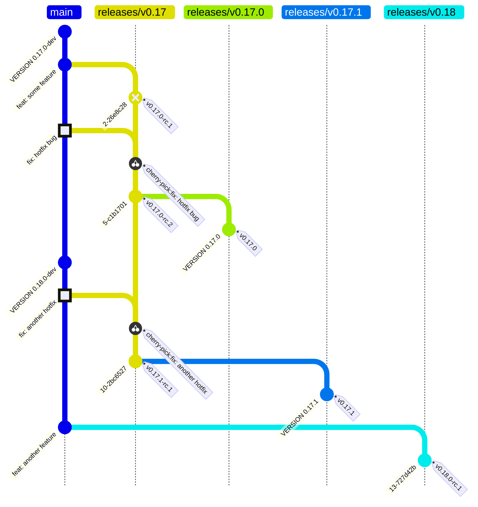

# Release Process

## General Information

In the Open Component Model organization, the *main development* is done on the
`main` branch. Thus, the `main` branch is used to develop on the latest minor
version.

The release process focuses on the creation of `release/<major>.<minor>` release
branches and the generation
of release tags based on these branches. Every release branch is used to
permanently track the development of a specific
minor release of the OCM project. Whenever there is a critical issue for a
specific minor release, a patch is `cherry-picked`
into the release branch and a new patch release for that given minor version is
created.

The release branches are initially created from the `main` branch via the GitHub
action [`Release Branch Creation`](./.github/workflows/release-branch.yaml).

A release is generated by calling a specific [
`release`](./.github/workflows/release.yaml) GitHub Action. It is
executed on the branch which should be released - regardless whether it is a
patch or a minor release.

In any case, a pre-release may be created by specifying a pre-release suffix for
the release action execution. This will lead (for most use cases) to the
creation of a "Release Candidate" which can be tested
and delivered to end users willing to test the new release.

## Release Workflow

### Diagram



### The Release Branch Creation / Cutoff

Every minor release starts with the creation of a release branch through [
`Release Branch Creation`](./.github/workflows/release-branch.yaml).

The version / minor of the release is based on the content of the file [
`VERSION`](./VERSION) which
is updated automatically said `release` action. During development, the
content of this file is the complete release name of the release currently under
development and the suffix `-dev` (e.g. `0.1.0-dev`). The content of this file
is used for generating the version information compiled into the ocm
executables.

The release branch is then created with the following steps:

1. `main` is checked out and the [`VERSION`](./VERSION) file is read.
2. The combination of `<major>.<minor>` is read from [`VERSION`](./VERSION) and used to create
   the branch name, e.g. `release/0.17`.
3. The branch is created and pushed to the repository.
4. A Pull Request is created by a bot to bump the [`VERSION`](./VERSION) file on `main` to
   the next minor version, e.g. `0.18.0-dev`.

At this point in time we call the minor release `0.17` cut-off.

This means that:

- We no longer accept features for the development of this branch
- We no longer accept breaking changes for the development of this branch
- Any change that is not a bug fix or a documentation change must be approved by
  the release manager
- Any bug fix that is not deemed critical must be approved by the release
  manager
- Any bug fix must first be merged to main and then [
  `cherry-picked`](https://git-scm.com/docs/git-cherry-pick) to the release
  branch.

At this point in time, any release targeted on this branch will have this minor
version as a base.

### Preparing a Minor release candidate

After the cut-off, the release manager will usually prepare a release candidate.
This is done by creating a pre-release on the release branch, that goes along
with a qualifying suffix.

Currently we only use one form of suffixed, pre-release, the
`Release Candidate`: Any Release Candidate
is testable by users and signalled in the form of
`<major>.<minor>.<patch>-rc.<rc-number>`.

If a release candidate is created, the `-dev`-suffix is removed and the suffix
`-rc.<rc-number>` is appended to generate the name of the release.

During the release, just before creating the git tag for a release,
the [VERSION](./VERSION) file is changed to include this new suffix.
The transformation thus looks like

```text
<major>.<minor>.<patch>-dev -> <major>.<minor>.<patch>-rc.<rc-number>
```

TODO: Currently all releases are created via tag only, so the VERSION bump
that is needed for the release is done through a dangling commit (a commit
that is not part of the history of any branch in the repository). This is not
ideal and should be changed in the future.
See [this issue](https://github.com/open-component-model/ocm/issues/1099)
for details.

### Creating a Minor release

Once a release candidate is seen as sufficiently tested, the release manager can
promote the release candidate to a full release.

By default one should always create a draft release first (as a Release
Candidate),
open it up for testing (by communicating the new release candidate as available
to stakeholders),
and after a grace period, promote the draft release to a full release.

This promotion is currently effectively a full rebuild from the release branch,
with the difference that the `-rc.<rc-number>` suffix is removed.

After the build, instead of finishing, the [
`release`](./.github/workflows/release.yaml) GitHub Action will also publish the
release.

This publishing to package registries (such as brew) is delegated to [
`publish-to-other-than-github`](./.github/workflows/publish-to-other-than-github.yaml)

After the official release on a release branch was successful, the version is considered `burned`.
This means that, even if bugs are found for that release in the future, a
`patch` release will be created for that release branch.

Concretely this means that the following additional steps are taken:

1. The release is tagged with the version number from the [`VERSION`](./VERSION)
   file, *without* the `-rc.<rc-number>` suffix.
2. The release is published on GitHub as the latest release, not as a
   pre-release.
3. The release is published to the package registries.
4. The [`VERSION`](./VERSION) is bumped in the release branch to the next <patch>,
   e.g. `0.17.0-dev` becomes `0.17.1-dev` via Pull Request.

### Creating a Patch release

The process to creating a patch release is almost equivalent to the process of
creating a minor release.

Whenever a patch release in the form of `<major>.<minor>.<patch>` is needed, the
branch `releases/<major>.<minor>` is used to prepare the release.
The only difference is that now the VERSION file should contain the suffix
`<major>.<minor>.<patch>-dev`
(which should have automatically been bumped on the last release).

This means that creating candidates for the patch or creating the release is
equivalent by using the [`release`](./.github/workflows/release.yaml) GitHub
Action.
Make sure that all patched commits have been cherry-picked from main.

*NOTE: It is not valid to create a fresh commit on a patch branch without a
corresponding cherry-pick from main.*

#### How to cherry-pick a commit from `main` to a `releases/x.y` branch

To cherry-pick a commit from `main` to a patch branch, the following steps are
necessary:

1. Checkout the release branch for the patch, e.g. `releases/0.17` for a patch
   release of `0.17.0` towards `0.17.1`.
2. Cherry-pick the commit from `main` to the patch branch, e.g.
   `git cherry-pick <commit-hash>`. Resolve conflicts as necessary.
3. Create a Pull-Request for the cherry-picked commit to the branch,
   and prefix the title with `[releases/<major>.<minor>]` (in this case
   `[releases/0.17]`)
   to signal that this is a patch commit, e.g. with `gh`:

   ```shell
   gh pr create \
      --title "[releases/0.17] cherry-pick: <Original PR or Commit>" \
      --body "Cherry-pick of <Original PR or Commit> from main to releases/0.17" \
      --base releases/0.17 \
      --draft
   ```

4. Merge the Pull-Request to the patch branch.

### How Release Notes are managed

For every release branch there is a Github Action
called [Release Drafter](./.github/workflows/release-drafter.yaml).
This workflow interprets the Pull Requests merged against main and the release
branches and generates a draft release
in Github which can be formed and edited.

Note that when you are updating the branches, the release notes currently get
overwritten from scratch so any edits get lost.
In case you want to permanently change the release notes, you will have to carry
them through all release candidates manually.
(TODO: this needs improvement by allowing us to do "append-only" style release
notes, see [this issue](https://github.com/open-component-model/ocm/issues/1097) for details)

## What is part of a release?

During the build of a release, an OCM CTF (Common Transport Format Archive) is
created (through `make ctf`), containing all the provided component versions
described by the actual git snapshot. This archive is then published to
ghcr.io/open-component-model/ocm. Additionally, a GitHub release is created,
exposing the OCM CTF and the ocm-cli executables for various platforms. These
executables are build using the go releaser plugin. Furthermore, packages for
various package managers (e.g. brew, debian or chocolatey) are created and
uploaded to the respective package repositories. All currently supported
installation methods are described
[here](https://github.com/open-component-model/ocm?tab=readme-ov-file#installation).

### Addendum

This release process got rewritten as of 0.19.0 and thus earlier releases
followed another model where release branches
were kept in the form of `releases/<major>.<minor>.<patch>` and the release
branches were created on demand.
This model has now largely been replaced by the model we see in
this document. However you might still encounter leftovers form the old model
and you are encouraged to create issues regarding inconsistencies.
