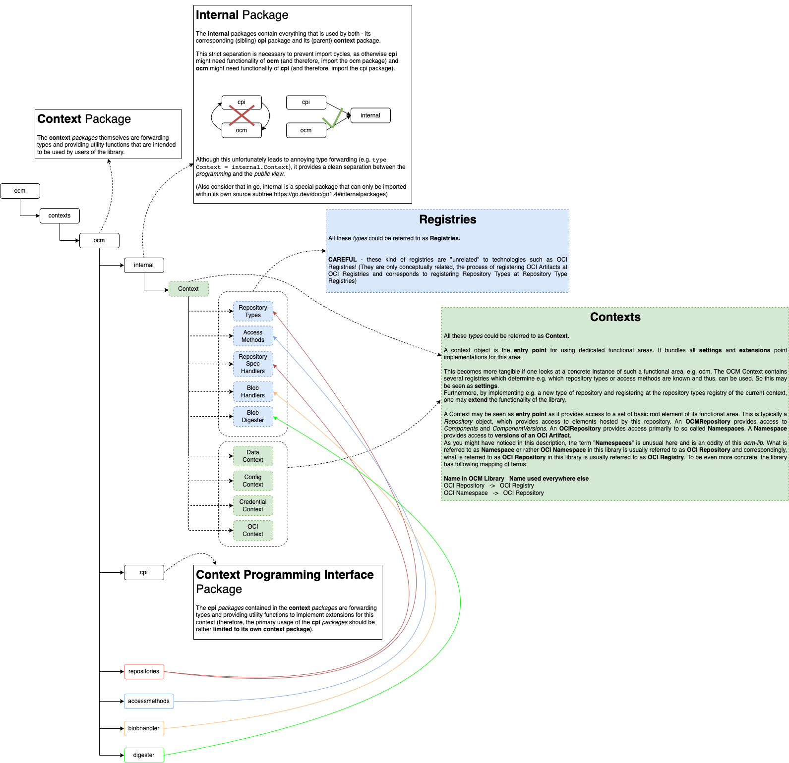
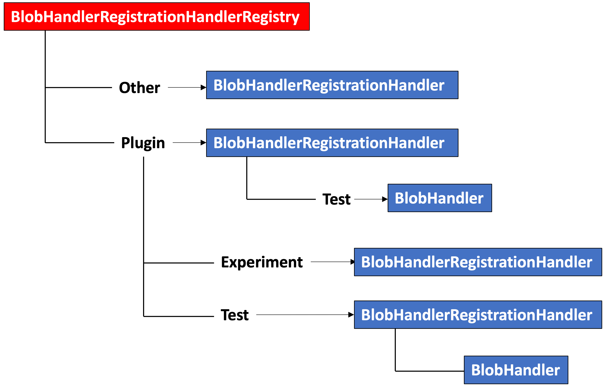

# Introduction to the **ocm-lib**

This document aims to provide an introduction to the **ocm-lib**.

## Prerequisites

A familiarity with the **Open Component Model (OCM)** is required. Good starting points are the corresponding
[website](https://ocm.software/) and the [specification](https://github.com/open-component-model/ocm-spec/).

## Section 1 - Complexity

As mentioned in the [specification](https://github.com/open-component-model/ocm-spec#storage-technology), an
*OCM Repository* is an interpretation layer on top of existing storage technologies and is not itself a repository
technology.  
Therefore, the ocm-lib has to deal with multiple
[storage technologies](https://github.com/open-component-model/ocm-spec#storage-technology) and their individual
authentication mechanisms. As it is impossible to forsee all potentially required storage technologies, the ocm-lib's
architecture also has to enable convenient extensibility.  
These extensibility requirements inherently lead to a certain degree of complexity.

## Section 2 - Architectural Concepts

Essentially, the ocm-lib revolves around a single architectural concept called **Registries** in the context of
this document.

### Section 2.1 - (Model) Type Registries

To avoid any confusion right from the beginning, a short explanation of the name **Type Registries**. The word _Type_ in
_Type Registry_ does not refer to a _technical type_ within your programming language, e.g. a _go type_ you defined, but
to a _type in your underlying model_.

Suppose you want to write an application for printing messages. Now you know beforehand that you at least have simple
messages that are merely a continuous text and more complex messages that are composed of a title and a text.
[Here](introduction/prototype-based-typeregistry/serializedmessages/) are examples how their respective serializations
may look
like. They both have a _type_ - `type: simplemessage` and `type: complexmessage`. These typenames are unique and
describe their **model types**. Now, _Type Registries_ are essentially maps that map a _model type_ (key) to a construct
in your programming language that can properly deal with that _model type_ (value). This might actually be dedicated go
type for each model type (as in the prototype-based type registry), but this might just as well be objects of the same
type with a dedicated configuration (as in the factory-based type registries).

#### Section 2.1.1 - Purpose

The concept and implementation of _Type Registries_ may initially seem unnecessary complex and cumbersome. But the power
of this concept becomes really apparent in the context of the [ocm](https://github.com/open-component-model/ocm-spec),
once one realizes that the whole standard revolves around
[Component Descriptors](https://ocm.software/docs/component-descriptors/version-3/) that are essentially bundled lists
of serialized typed (and versioned) objects.

Furthermore, the concept is great for extensibility. To create a new type, you can theoretically just create a new
self-contained package implementing this type and register it at the corresponding _DefaultRegistry_ and you are good to
go (so the code perfectly abides to the _open-closed principle_).

#### Section 2.1.2 - Prototype-Based Type Registry

_This kind of Type Registry only works if there is a **dedicated go type** for each **model type**, and if it is
sufficient to directly decode
the serialized data into an empty object of that go type without requiring further processing._

The [prototype-based-typeregistry](introduction/prototype-based-typeregistry) directory contains a quite minimal example
implementation of a single _Prototype-Based Type Registry_ that will be used as reference to explain the concept
(instead of reading this lengthy explanation, you can also just check out the well-documented code). The example creates
a _Type Registry_ for types implementing the
following [Message](introduction/prototype-based-typeregistry/registry/interface.go)
interface.

```
type Message interface {
   Print()
}
```

In _Prototype-Based-Type-Registries_, the Registry is essentially a map that stores the model type name (key) and a
prototype object of a dedicated go type implementing the corresponding functionality (value). This prototype object is
used to create new objects of that type  (leveraging the reflection library).

```
type MessageRegistry map[string]Message
```

Typically, the [package defining the type registry](introduction/prototype-based-typeregistry/registry/registry.go) also
declares and
initializes a _DefaultRegistry_, a global variable that can be used by other packages to register their implementation
of the respective type (here, Message).

```
var DefaultMessageRegistry = MessageRegistry{}
```

To register themselves at the _DefaultRegistry_, these other packages implement their
[init-function](https://go.dev/doc/effective_go#init) respectively (thereby, the type name should obviously be unique).

```
const TYPE = "simplemessage"

func init() {
   registry.DefaultMessageRegistry[TYPE] = &Message{}
}
    
type Message struct {
   Type string `json:"type"`
   Text string `json:"text"`
}
    
func (m *Message) Print() {
   fmt.Println(m.Text)
}
```

Keep in mind that although the
[_simplemessage_](introduction/prototype-based-typeregistry/types/simplemessage/message.go) and
[_complexmessage_](introduction/prototype-based-typeregistry/types/complexmessage/message.go) packages might not be
directly used in other packages, they have to be imported for their side effects (in other words, to execute their
init-functions). You may use empty imports to achieve this.

```
import (
   _ "example/typeregistry/types/complexmessage"
   _ "example/typeregistry/types/simplemessage"
)
```

Now, the prepared _DefaultRegistry_ can be used to dynamically unmarshal serializations of the types into their
respective go types.

The [registry](introduction/prototype-based-typeregistry/registry/registry.go) has a function implementing the dynamic
unmarshaling logic. To understand this, it's best to check out the well-documented method within the example.

#### Section 2.1.3 - Factory-Based Type Registry

In _Factory-Based Type Registries_, the Registry is essentially a map that stores the model type name (key) and a
factory object (thus, an object capable of producing Message objects). Thereby, it is possible to overcome the
limitations of the Prototype-Based Type Registries (the necessity of a dedicated go type per model type and not being
able to edit the object after unmarshaling).

Based on the knowledge about Prototype-Based Type Registry, it should be possible to understand the well-documented
[Factory-Based Type Registry](introduction/factory-based-typeregistry) example.

#### Note

The ocm-lib has several kinds of type registries (thus, corresponding to our example, not only a Message Registry
but also for other types). Therefore, it has a generic implementation of a registry which can be reused.  
Furthermore, its implementation of the registry has to be thread safe and provides some convenience functionality.
Therefore, it may be slightly more difficult to understand than our examples.

### Section 2.2 - Contexts

The ocm-lib defines multiple _Context_ types. The documentation of the library states that objects of these _Context_
types bundle all settings and extension point implementations for this area.

**Extension Point Implementations:** On a conceptual level, each package providing a type that implements an interface
that has a corresponding _Type Registry_ is considered an extension point implementation (in the previous
examples, the _simplemessage package_ and the _complexmessage package_ are extension points as they
implement the _Message_ interface and there is a _Message Type Registry_).  
**Settings:** On a conceptual level, settings are values that may be set for specific objects or passed to specific
functions as an attribute to influence the behavior, e.g. a repository object might have fields username and password
that can be set and will be used by the respective access method on that object to access the repository **or** the
username and password may be passed directly to the respective function (in the [context](introduction/context) example,
the print settings are settings as they are used within the print methods of functions).

So, on a conceptual level, _Context_ objects are containers for a number of _Type Registries_ and _Settings_ (as
shown in the [context](introduction/context) example). They provide several methods that rely on that information (for
example, the dynamic unmarshaling, as this depends on the types (or rather extension points) registered in registry).
Furthermore, they are passed into other objects, so that they can access the respective settings (like the Message
objects access the print settings within the example).

## Section 3 - Mapping the concepts to the ocm-lib

The following explanations shall help mapping the just explained concepts to their usage in the ocm-lib and to get a
general idea of the directory structure.

### Section 3.1 - Overview

The picture below shows the basic structure of the ocm-lib's [ocm context package](../../pkg/contexts/ocm). As all
context packages follow the same structure, the overview should be sufficient to navigate the other context packages.

The elements within this overview (_Registries_ and _Contexts_) are explained below.



### Section 3.2 - Registries

Here, the different _Registries_ shown in the overview are explained.

### Section 3.2.1 - Repository Types Scheme

A `RepositoryTypeScheme` is an object that maps a number of _repository types (= model type)_ to corresponding
_factories_ providing a repository spec object which is again a factory for providing an object of a specific type or
with a specific configuration for dealing with this _repository type (= model type)_.

There exist multiple _Repository Type_ Registries within the ocm-lib. There is a Repository Type Registry
for [**OCM** _repository types (= model types)_](../../pkg/contexts/ocm/repositories) and a Repository Types
Registry for [**OCI** _repository types (= model types)_](../../pkg/contexts/oci/repositories).

**OCI Repository Types:**  
Having multiple _OCI Repository Types_ may initially sound confusing. Therefore, a short explanation on what
_OCI Repositories_ and _OCI Repository Types_ even are in the context of the ocm-lib. From the perspective of the
ocm-lib, any _go type_ that implements the following [interface](../../pkg/contexts/oci/internal/repository.go) can be
considered an _OCI Repository_:

```
type Repository interface {
   GetSpecification() RepositorySpec
   NamespaceLister() NamespaceLister

   ExistsArtifact(name string, ref string) (bool, error)
   LookupArtifact(name string, ref string) (ArtifactAccess, error)
   LookupNamespace(name string) (NamespaceAccess, error)
   Close() error
}
```

Within the ocm-lib, there are multiple implementations of this interface. Most prominently, an implementation for actual
[_OCI Registries_](../../pkg/contexts/oci/repositories/ocireg). If you are familiar with _OCI Registries_, the
terminology here may be counterintuitive. In the ocm-lib, the term _OCI Repository_ corresponds to what is commonly
known as an _OCI Registry_, and a _Namespace_ corresponds to what is commonly known as an _OCI Repository_.  
Another implementation is the so-called _[Common Transport Format](../../pkg/contexts/oci/repositories/ctf)_. The
_[Common Transport Format specification](https://github.com/open-component-model/ocm-spec/blob/main/doc/appendix/A/CTF/README.md)_
was developed in the context of the Open Component Model and describes a file system structure that can be used for the
representation of content of an OCI Registry.  
As one might notice within the [package](../../pkg/contexts/oci/repositories/), besides `OCIRegistry` and `Common
Transport Format`, there are further _OCI Repository Types_, namely, `DockerDaemon` and `ArtifactSet`. These are not
"equal" implementations compared to `OCIRegistry` and `CommonTransportFormat`. The _docker daemon_ is limited to
handling _OCI Images_ and therefore cannot deal with _OCI Artifacts_. An _artifact set_ can only hold versions of the
same
artifact (thus, it corresponds to a Namespace or rather OCI Repository in that regard), but implements the _OCI
Repository_ interface.

**OCM Repository Types:**
So, corresponding to OCI Repositories and OCI Repository Types, any _go type_ that implements the following
[interface](../../pkg/contexts/ocm/internal/repository.go) can be considered an _OCM Repository_:

```
type Repository interface {
   GetContext() Context

   GetSpecification() RepositorySpec
   ComponentLister() ComponentLister

   ExistsComponentVersion(name string, version string) (bool, error)
   LookupComponentVersion(name string, version string) (ComponentVersionAccess, error)
   LookupComponent(name string) (ComponentAccess, error)

   Close() error
}
```

Again, within the ocm-lib, there are multiple implementations of this interface. But most importantly, the package
[`genericocireg`](../../pkg/contexts/ocm/repositories/genericocireg) provides an implementation of the _OCM Repository
interface_ that is based on the _OCI Repository interface_. In other words, this package provides a mapping of the
_OCM Repository_ functionility to the _OCI Repository_ functionality. The
[`ocireg`](../../pkg/contexts/ocm/repositories/ocireg) package and the [`ctf`](../../pkg/contexts/ocm/repositories/ctf)
merely provide the functionality to convert, or rather wrap, their _OCI Repository Spec_ to an _OCM Repository Spec_
(remember, spec types were pretty much serializable representations and factories for the actual type, as explained
[here](introduction/context/registry/registry.go)).  
For each _OCI Repository Type_, there also exists a corresponding _OCM Repository Type_.
Thus, as there is an **oci** _repository type_ `OCIRegistry`, there is also an **ocm** _repository type_ `OCIRegistry`,
as there is an **oci** _repository type_ `CommonTransportFormat`, there is also an **ocm** _repository type_
`CommonTransportFormat`.
Within the ocm-lib this is implemented through an **addition to the factory-based type registry** concept. In case the
does not find an entry for a certain type (within the Decode method), this
[implementation (defaultScheme)](../../pkg/runtime/scheme.go) of a factory-based type registry has a _fallback factory_
(called `defaultdecoder`). For the OCM Repository Type Registry, this _fallback factory_ is usually
[initialized](../../pkg/contexts/ocm/builder.go) with a Type Registry itself, the
[`DefaultDelegationRegistry`](../../pkg/contexts/ocm/repositories/genericocireg/type.go) which is based on the
[`delegationRegistry`](../../pkg/contexts/ocm/internal/delegation.go). This Type Registry's iterates through all its
factories and checks whether they knew that type. Currently, the only factory known by this _fallback Type Registry_ is
the one registered in the [`genericocireg`](../../pkg/contexts/ocm/repositories/genericocireg/type.go) package which
uses the **oci** _repository types registry_ to perform the unmarshaling (thus, if I registered the type in the
oci repository types registry, it is automatically available for the ocm repository registry).

**Other Repository Types:**
Besides _OCM_ and _OCI Repository Types_, there currently also exist a number of
[_Credential Repository Types_](../../pkg/contexts/credentials/repositories) that have to implement the following
[interface](../../pkg/contexts/credentials/internal/repository.go):

```
type Repository interface {
   ExistsCredentials(name string) (bool, error)
   LookupCredentials(name string) (Credentials, error)
   WriteCredentials(name string, creds Credentials) (Credentials, error)
}
```

### Section 3.2.2 - Access Type Scheme

An `AccessTypeScheme` is an object that maps a number of _access types (= model type)_ to corresponding
_factories_ providing an access spec object which is again a _factory_ for providing an object of a specific type or
with
a specific configuration for dealing with this _access type (= model type)_.

From the perspective of the ocm-lib, any _go type_ that implements the following
[interface](../../pkg/contexts/ocm/internal/accesstypes.go) can be considered an _OCI Repository_:

```
type AccessMethod interface {
   DataAccess

   GetKind() string
   AccessSpec() AccessSpec
   MimeType
   Close() error
}
```

Within ocm-lib, there are multiple implementations of this interface. Most prominently, an implementation for
[_OCI Artifacts_](../../pkg/contexts/ocm/accessmethods/ociartifact/method.go) (artifact blob is stored as an independent
oci artifact in an OCI Registry), a dedicated technical procedure of how to access an artifact blob stored in an OCI
Registry. There are further implementations, e.g. for [_Local Blobs_](../../pkg/contexts/ocm/accessmethods/localblob)
(artifact blob is stored in the same oci artifact as its component descriptor), for  
[_s3_](../../pkg/contexts/ocm/accessmethods/s3) or for [_gitHub_](../../pkg/contexts/ocm/accessmethods/github).

**CAREFUL - There are two conceptually relevant details here!**

1) There are **Global** and **Local** **Access Method types**. **Global types** (such as ociArtifact or github)
   implement the procedure to access the artifact blobs themselves. **Local types**, on the contrary, delegate the
   implementation of the procedure to the respective component repository (as each type of component repository may
   handle the storage of artifact blobs alongside the component descriptor differently).
2) **AccessMethods return the artifact blob as is**. Thus, if a helm chart is stored as an .tar, the AccessMethod will
   return the bytes of the .tar. If, on the other hand, the helm chart is stored as an tar.gz , the AccessMethod will
   return the bytes of the .tar.gz. Therefore, for further processing, the MimeType() can be read (inspecting the
   MimeType and conversion to a target format can be done with downloaders - a convenience feature implemented by the
   ocm library kind of as an add-on).

### Section 3.3 - Constraint Registries aka. Handler Registries (and Handler-Registration Handler Registries)

**Constraint Registries aka. Handler Registries**  
So up to now, we were looking at _Type Registries_. These have the purpose of unmarshaling. Therefore, these
_Type Registries_ typically map a _model type_ (e.g. a _repository type_ or an _access type_) to corresponding
_factories_ providing a _spec object_ which is again a _factory_ for providing an object of a specific type or with a
specific configuration for dealing with this model type (e.g. a _repository_ or an _access method_).

From a technical perspective **Constraint Registries** work pretty much exactly the same. But their purpose is
not unmarshaling. While an _object_, or rather a _factory_, within a _Type Registry_ is selected within the decoding
logic based on the specified _type_ (a respective _Decode Spec_ method is typically exposed by the Type Registry
itself),
an _object_ within a _Constraint Registry_ is selected during some other event based on a number of constraints (a
respective _Lookup Handler_ method is typically exposed by the Constraint Registry itself). So instead of a _type_, e.g.
a _Blob Handler Registry_ (a _Blob Handler_ is a handler responsible for uploading blobs into a specific store) stores
a triple of _RepositoryType_ (e.g. `OCIRegistry`, `CommonTransportFormat`, ...), _ArtifactType_ (e.g. `OCIArtifact`,
`ociImage`, ...) and _MimeType_ (e.g. `text/plain`, `application/gzip`, ...). The upload logic passes the current
contextual information about the underlying _storage repository type_ and the _artifact_ and _mime type_ at hand to the
_Lookup Handler_ method a _Constraint Registry_, which eventually returns a number of _Handlers_ fulfilling the
_Constraint_ formed by these arguments.

**Type Registry:** _model type (key)_ &rarr; _decoder / factory for a decoder (value)_  
**Constraint Registry:** _constraint (key)_ &rarr; _handler (value)_

**Handler-Registration Handler Registries**  
Quite frequently, _Constraint Registries_ are themselves also **Handler-Registration Handler Registries**. A
**Handler-Registration Handler** is, as the name suggests, a **Handler**  that handles the registration of other
Handlers (in other words, the **Handler-Registration**).  
A **Handler-Registration Handler** has to implement the following [interface](../../pkg/registrations/registrations.go):

```
type HandlerRegistrationHandler[T any, O any] interface {
   RegisterByName(handler string, target T, config HandlerConfig, opts ...O) (bool, error)
}
```

And a Handler-Registration Handler Registry has to implement the following corresponding
[interface](../../pkg/registrations/registrations.go):

```
type HandlerRegistrationRegistry[T any, O any] interface {
   HandlerRegistrationHandler[T, O]
   RegisterRegistrationHandler(path string, handler HandlerRegistrationHandler[T, O])
   GetRegistrationHandlers(name string) []*RegistrationHandlerInfo[T, O]
}
```

Thus, a `HandlerRegistrationHandlerRegistry` also is itself also a  `HandlerRegistrationHandler`.

Without going into too much detail, the purpose of a _Handler-Registration Handler_ is to _register_ a _Handler_
identified by the `handler string` parameter at a _Constraint Registry_.  
Usually, directly within the library, such a functionality is not really necessary. If you want to add e.g. a new
_type_ of `BlobHandler`, you implement the `BlobHandler` interface and register that implementation at a corresponding
`BlobHandlerRegistry` by calling the BlobHandlerRegistry's _Register_ method (e.g. in an
[init](../../pkg/contexts/ocm/blobhandler/oci/ocirepo/blobhandler.go) function to register that implementation in a
DefaultRegistry). Thereby, you have to pass an object of that handler implementation to the _Register_ method.  
But imagine you are working with the _ocm-cli_ and you want to register either a predefined `BlobHandler` (in other
words, a `BlobHandler` that is already implemented in the library). With the _ocm-cli_ you cannot pass an object of a
specific handler implementation. Instead, you would like to be able to _Register_ a specific _BlobHandler_ by its
_Name_ (**RegisterByName**) which you can pass as a string. This can be done through the _Handler-Registration Handler
Registries_ and their registered _Handler-Registration Handlers_.  
A _Handler-Registration Handler Registry_ maintains a _hierarchical namespace_, as indicated by the figure below.



Thus, the _Handler-Registration Handlers_ are registered under a _hierarchical name_, such as `Plugin/Test`. In the
example in the figure, either `Plugin` as well as `Plugin/Test` have a _Handler-Registration Handler_ registered. The
_Handler-Registration Handlers_ maintain a namespace themselves.  
For some method call such as `RegisterByName("Plugin/Test", ...)` at the `BlobHandlerRegistrationHandlerRegistry`, there
would be two possible ways to resolve the `"Plugin/Test"` handler name.

1) The `BlobHandlerRegistrationHandlerRegistry` selects the `BlobHanderRegistrationHandler` at `"Plugin"` and registers
   the corresponding `"Test"` BlobHandler at its corresponding Registry.
2) The `BlobHandlerRegistrationHandlerRegistry` selects the `BlobHanderRegistrationHandler` at `"Plugin/Test"` and
   registers the corresponding ("anonymous") BlobHandler at its corresponding Registry.

The current standard implementation of the `HandlerRegistrationHandlerRegistry` uses variant 2), therefore, it always
resolves the _handler name_ with the **longest matching path** within its hierarchical namespace.

As a `HandlerRegistrationHandlerRegistry` is a `HandlerRegistrationHandler` (see
[interface](../../pkg/registrations/registrations.go)), a `HandlerRegistrationHandlerRegistry` could theoretically also
contain other`HandlerRegistrationHandlerRegistries`.

This _register by name_ mechanism is especially also used to register _plugin implementations_ of _handlers_ at their
corresponding _registries_ ([here](../../pkg/contexts/ocm/blobhandler/generic/plugin/registration.go) is the
`HandlerRegistrationHandler` for _plugin implementations_ of `BlobHandler`).

### Section 3.2.3 - Repository Spec Handlers

The `RepositorySpecHandlers` can be considered a _Constraint Registry_ providing _Handlers_ for converting the so
called _UniformRepositorySpecs_ (a uniform string representation for RepositorySpecs) into the repository type
specific _RepositorySpec_ representation. Therefore, its constraint merely consists of the _Repository Type_.  
As it is rather cumbersome to enter JSON objects such as a RepositorySpec through the command line and as there may be
multiple types of Repository Specs for certain Repository Types (e.g. legacy types), the ocm-cli allows to enter a
uniform string representation called `UniformRepositorySpec` of a Repository Spec. Be aware, there are again different
UniformRepositorySpecs for [OCM Repositories](../../pkg/contexts/ocm/internal/uniform.go) and for
[OCI Repositories](../../pkg/contexts/oci/internal/uniform.go). Furthermore, _ocm_ and _oci references_, or rather
_reference strings_ (e.g. `eu.gcr.io/gardener-project/landscaper/examples/charts/hello-world:1.0.0`) are parsed into a
[representation that is based on a `UniformRepositorySpec`](../../pkg/contexts/oci/ref.go). Thus, to get access to the
respective Repository through the ocm-lib, this `UniformRepositorySpec` first has to be converted into a corresponding
`RepositorySpec`.  
In conclusion, a `RepositorySpecHandlers` _Constraint Registry_ is an object that maps a _repository type
(= constraint)_ to a number of corresponding `RepositorySpecHandler` objects that might be able to convert a
`UniformRepositorySpec` into the appropriate `RepositorySpec` for that _Repository Type_. Therefore, a
`RepositorySpecHandler` has to implement the following [interface](../../pkg/contexts/ocm/internal/uniform.go):

```
type RepositorySpecHandler interface {
   MapReference(ctx Context, u *UniformRepositorySpec) (RepositorySpec, error)
}
```

A `RepositorySpecHandlers` Registry **is not** also a `HandlerRegistrationHandlerRegistry`.

### Section 3.2.4 - Blob Handler Registry

The `BlobHandlerRegistry` can be considered a _Constraint Registry_. To avoid confusions, let's first clarify that the
name
_Blob Handler_ might be misleading as the only purpose of a _Blob Handler_ is the upload of blobs. This is also
immediately visible when looking at their [interface](../../pkg/contexts/ocm/internal/blobhandler.go):

```
type BlobHandler interface {
   StoreBlob(blob BlobAccess, artType, hint string, global AccessSpec, ctx StorageContext) (AccessSpec, error)
}
```

A much more suitable name would therefore be _Blob Uploader_.

When a _Component Version_, or rather, a _Component Descriptor_, is imported into an _OCM Repository_, a decision has
to be made about how to deal with the _artifacts_, or rather, the _artifact blobs_ (e.g. does it stay a local artifact
stored alongside the _Component Descriptor_ or is it uploaded into an _OCI Registry_ as an independent _OCI Artifact_?).
These decisions can be made within BlobHandlers. The `StoreBlob` method has to return an `AccessSpec` that can then be
inserted into the corresponding new _Component Descriptor_.

A `BlobHanderRegistry` **is** also a `HandlerRegistrationHandlerRegistry`.

### Section 3.2.5 - Blob Digester Registry

The `BlobDigesterRegistry` can be considered a _Constraint Registry_ providing _Handlers_ for calculating the _digest_
of a _blob_. In theory, the digest could be calculated over the byte sequence of the blob. But e.g. for archives, the
digest may
change through unpacking and repacking processes (dates may be added or changed, the order of specific elements
may change). As a consequence, the same artifact could have different digests which would be a problem regarding
signing. Therefore, there exist _digesters_ for _specific mime types_ e.g. an OCI Artifact digester, that calculates the
digest over the byte sequence of the OCI artifact representation which always has to be the same per specification.
Generally, a `BlobDigester` is anything that allows to calculate the digest for blobs with specific mime types through
the following [interface](../../pkg/contexts/ocm/internal/digesthandler.go):

```
type BlobDigester interface {
   GetType() DigesterType
   DetermineDigest(resType string, meth AccessMethod, preferred signing.Hasher)   (*DigestDescriptor, error)
}
```

A BlobDigesterRegistry currently **is not** also a `HandlerRegistrationHandlerRegistry`.

## Section 3.4 - Contexts

Here, the different _Contexts_ shown in the overview are explained.

A context object is the _entry point_ for using dedicated functional areas. It bundles all _settings_ and
_extensions point implementations_ for this area.

This becomes more tangible if one looks at a concrete instance of such a functional area, e.g. ocm. The _OCM Context_
contains several _registries_ which determine e.g. which _repository types_ or _access methods_ are known and thus, can
be used. As explained in [section 2.2](#section-22---contexts), the implementation registered at those registries are
considered to be _extension point implementations_.  
A repository object might require credentials (e.g. username and password) to access its contents. As explained in
[section 2.2](#section-22---contexts), these credentials are considered to be _settings_.

A _Context_ may be seen as entry point as it provides access to a set of basic root element of its functional area. This
is typically a repository object, which provides access to elements hosted by this repository.  
An _ocm repository_ provides access to _Components_ and _ComponentVersions_. An _oci repository_ provides access
primarily to so-called _Namespaces_. A _Namespace_ provides access to versions of an _oci artifact_.
As you might have noticed in this description, the term _"Namespaces"_ is unusual here and is an oddity of this ocm-lib.
What is referred to as _Namespace_ or rather _OCI Namespace_ in this library is usually referred to as _OCI Repository_
and correspondingly, what is referred to as _OCI Repository_ in this library is usually referred to as _OCI Registry._
To be even more concrete, the library has the following mapping of terms:

```
Name in OCM Library             Name used everywhere else
OCI Repository          ->      OCI Registry
OCI Namespace           ->      OCI Repository
```

### Section 3.4.1 - Data Context

The _DataContext_ type is kind of the _base context of all Context types_. Therefore, every Context type
(except the Data Context itself) contains a DataContext object.  
Essentially, a _DataContext_ object contains the _type information_ of the Context object it is the base for (e.g.
ocm.context.ocm.software in case of an OCM Context) and a _specific attribute store_ (and internally also a pointer to
the Context object it is the base for).

The _DataContext_ is an _AttributeContext_ itself and therefore, the attribute store of the DataContext works the same
as explained in [AttributesContext](#section-342---attributes-context).

### Section 3.4.2 - Attributes Context

Every Context object - besides the DataContext, which is itself an AttributesContext - contains an AttributesContext
object. An AttributesContext also contains a DataContext object and can contain other AttributesContexts.  
Primarily, an _AttributesContext_ provides an _attribute store which can store arbitrary attributes_ (on a low level,
this is implemented through a `map[string]interface{}`). These arbitrary attributes are typed (thus, the object has a
unique type attribute specifying its own type, e.g.
[`github.com/mandelsoft/ocm/ociuploadrepo`](../../pkg/contexts/ocm/attrs/ociuploadattr/attr.go)) and have to have a go
type that enables marshaling and unmarshaling, so that the attributes can also be used through the ocm-cli. In other
words, an _attribute type_ has to implement the following [interface](../../pkg/contexts/datacontext/attrs.go):

```
type AttributeType interface {
   Name() string
   Decode(data []byte, unmarshaler runtime.Unmarshaler) (interface{}, error)
   Encode(v interface{}, marshaller runtime.Marshaler) ([]byte, error)
   Description() string
}
```

So, before an attribute is stored in an AttributesContext's attribute store, it is checked, whether its type is
registered as AttributeType at a global registry object called `DefaultAttributeScheme` (this is another type registry
that was not explicitly covered in the previous section).  
As every type of Context object contains an AttributeContext object, functions on Context types can try to access
attributes in the AttributesContext. For example, the `StoreBlob` method of a `BlobHandler` accesses an `ociuploadattr`
on the DataContext. This attribute can specify an _oci registry_ where all the artifacts shall be uploaded to and
thereby may overwrite the default behaviour of uploading the artifacts to the same _oci registry_ as their Component
Descriptor.

Attributes stored in the AttributesContext of a context overwrite corresponding attributes stored in the DataContext of
the same context.

### Section 3.4.3 - Config Context

A _ConfigContext_ object configures other _configurable objects_ (e.g. Credential Context) using _typed configuration
objects_ (thus, the object has a unique type attribute specifying its own type, e.g. `credentials.config.ocm.software`).

**Conceptual Background - Config Objects**  
_This is pretty much how it works, but for reasons that will become clear later on, the ApplyTo function interface has
an additional parameter compared to how it's introduced here._

Each _config object type_ has to have an `ApplyTo(target interface{})` method that knows what type of configurable
object(s) it can configure (this "knowledge" is typically implemented through an if-statement based on a type-assertion
on the target, [as shown here](../../pkg/contexts/credentials/config/type.go)). If the method receives a suitable
configurable object as target (thus, the type-assertion on the target returns true), it calls corresponding functions on
the target to apply its respective configuration (e.g. , a _credential config object_ calls the
`credentialContext.SetCredentialsForConsumer` method passing in the respective arguments,
[as shown here](../../pkg/contexts/credentials/config/type.go)).

To conclude this, technically, in order to configure specific objets such as the credential context - let's call it
`credctx` - one could use a _configuration object_ of the corresponding type, here a
[credential configuration object](../../pkg/contexts/credentials/config/type.go) - let's call it `credcfg` - and call
`credcfg.ApplyTo(credctx)`.

Typically, each directory that contains _configurable objects_ (so pretty much each directory under
[contexts](../../pkg/contexts/), as each context object is a configurable object) also has a corresponding _config
package_ with a _type.go_ file, defining the _config object type_ and registering it at the
[`DefaultConfigTypeScheme`](../../pkg/contexts/config/internal/configtypes.go).

**Conceptual Background - ConfigContext**  
_This is, where it might get confusing, but bear with me._

A _ConfigContext_ object is a _configurable object_ itself. The _config object type_ to configure the _ConfigContext_ is
`generic.config.ocm.software`. Such a `config object` is pretty much only a container for (other) `config objects`
(thus, it simply contains a list of `arbitrarily typed config objects`). Calling the `ApplyTo(target interface{})`
method of such an object with a _ConfigContext_ as target adds all the _config objects_ contained in this container
_config object_ to a `ConfigStore` within the _ConfigContext_.

**ConfigContext**   
_This is how the library intends to work with config objects._

The _config objects_ are usually not applied directly to one or multiple configurable objects (thus, calling the Config
objects `ApplyTo(target interface{})` passing in each _configuration object_ as target). Instead, a _ConfigContext_
provides an [`ApplyConfig(spec Config, description string)`](../../pkg/contexts/config/internal/context.go) method.  
Essentially, this function does two things:

1) Call `spec.ApplyTo(target interface{})`, passing in the _ConfigContext_ it is called upon as _target_
2) Adding the spec (thus, the _config object_) to the `ConfigStore` of the _ConfigContext_

**Here's an example to better grasp this behaviour:**  
Let `cfgctx` be an object of type _ConfigContext_ and `credcfg` be a
[_credential config object_](../../pkg/contexts/credentials/config/type.go) (`credentials.config.ocm.software`, the
_config type_ to configure _CredentialContext_ objects).  
Assume the following method call:

```
cfgctx.ApplyConfig(credcfg, "credential")
```

1) Now, as previously described, the function first calls `credcfg.ApplyTo(cfgctx)`. As the `credcfg` object's `ApplyTo`
   method knows that it can only configure objects of type _CredentialContext_ and not of type _ConfigContext_, this
   function call does not have any effect!
2) After the `ApplyTo` method returns, regardless of the type of the config object, it is added to the `ConfigStore` of
   the `cfgctx`.

Now, let `cfgctx`, again, be an object of type _ConfigContext_ and, instead of `credcfg`, we now have a _config config
object_ called `cfgcfg` (`generic.config.ocm.software`, the _config type_ to configure _ConfigContext_ objects).  
Assume the following function call:

```
cfgctx.ApplyConfig(cfgcfg, "config")
```

1) Now again, the method first calls `cfgcfg.ApplyTo(cfgctx)`. As the `cfgcfg` object's `ApplyTo` method knows that it
   can configure objects of type _ConfigContext_, this function call proceeds and adds all _configuration objects_
   within the `cfgcfg` object (remember, it's a container for other configuration objects) to the _ConfigStore_ of the
   `cfgctx`.
2) After the `ApplyTo` method returns, the `cfgcfg` object itself (thus, the container) is added to the `cfgctx`
   (if the `cfgcfg` object contained 3 different _credential config objects_, the _ConfigStore_ would now contain the 3
   _credential config objects_ and also the `cfgcfg` object, thus, 4 objects in total).

_"Cool, now I've got an ConfigContext object containing all my configuration objects, but what's the benefit? How are
they applied to the actual objects they shall configure?"_

**Updater**  
_This is an internal implementation detail, a user of the library does not have to deal with the updater, but it is
important if you want to understand, how the configuration objects within the ConfigStore of a ConfigContext are
applied to the actual configurable objects._

_Configurable objects_ (e.g. OCM Context, OCI Context, Credential Context) do not directly contain a _ConfigContext_
object or rather a pointer to a _ConfigContext_ object. Instead, they contain an _Updater_ object which maintains a
pointer to a _ConfigContext_. Essentially, the _Updater_ consists of the triple
_(ConfigContext, Target, LastGeneration)_.  
The **Target** is a _configurable object_, typically. the _configurable object_ that contains the respective _Updater_.
The **LastGeneration** is an integer. The _ConfigContext_ also maintains a corresponding _Generation_ integer, which is
increased by 1 each time a new _config object_ is added to the _ConfigStore_.
Every method of a _configurable object_ that uses a potentially configurable part of the configurable object calls its
Updaters `Update()` method before performing any other processing. This _Update()_ method compares the ConfigContext's
_Generation_ with the _LastGeneration_ and calls the `ApplyTo` method of each _config object_ added since the
_LastGeneration_, passing in the Updater's _Target_ object as target.  
This mechanism allows the transparent configuration of objects through a uniform interface.

**FAQ:**  
Why does the ConfigContext store the Container Config object (generic.config.ocm.software) in its ConfigStore?  
&rarr; The _ConfigContext_ does not know anything about this _container config object_ type. There could be further
types of _config objects_ that configure the _ConfigContext_ (and eventually even other types of configurable objects
too). These would have to be stored in the _ConfigStore_. Therefore, not storing the _container config objects_ would
require special treatment, which is not necessary.

Why do the ConfigObjects apply themselves to the configurable objects and not the other way around? In other words, why
don't the configurable objects provide an apply method?  
&rarr; As the _configurable objects_ do not have to know anything about their _config objects_, it is easy to create an
additional _config object types_ (this type would only have to register itself to the respective _ConfigTypes Registry_,
and it would be good to go!)

### Section 3.4.4 - Credential Context

A _CredentialContext_ object serves two purposes:

1) it stores _Consumers_ (indirectly in form of _Consumer Providers_)
2) it provides access to _Credential Repositories_ (just like the OCM Context provides access to OCM Repositories or the
   OCI Context provides access to OCI Repositories)

**Credential Management:**  
There are several kinds of _credential consumers_ (e.g. GitHub, HelmChartRepositories, OCIRegistries) with potentially
completely different kinds of credentials (e.g. `{key:<GitHubPersonalAccessToken>}` in case of
[GitHub](../../pkg/contexts/credentials/builtin/github/identity/identity.go) or
`{username:<basic auth name>, password:<basic auth password>, certificate:<TLS client certificate>,
privateKey:<TLS private key>}` in case of [HelmChartRepositories](../../pkg/helm/identity/identity.go)).

To account for these different kinds of _consumers_ and _credentials_, the credential management is based on **generic
consumer identities** and **generic credential property sets**.  
The **generic consumer identities** are composed of a _consumer type_ and a _set of properties_ further describing the
context the credentials are required for. The _consumer type_ specifies a dedicated type of consumer (e.g. GitHub,
HelmChartRepositories, OCIRegistries) and thereby also implicitly determines a standard _identity matcher_ (These
standard identity matchers are typically registered at a globally variable called StandardIdentityMatchers
(another registry not previously covered) during the initialization. When creating a _DefaultContext_, this variable is
assigned to the _IdentityMatchers Registry_ of the _CredentialContext_). The _set of properties_ specifying the usage
context usually depends on the _consumer type_. _consumer identities_ with the consumer type Github typically specify
hostname, port and potentially a pathprefix.  
The **generic credential property sets** generally also depend on the _consumer type_. But even for a concrete consumer
type they may vary (e.g. OCIRegistry allows authentication with username and password, but also with an identity token).
Therefore, after retrieving the _credentials_ through the ConsumerIdentity matching logic, the consumer implementation
may have to check which kind of credentials it has (e.g. the OCIRegistry implementation tries to retrieve a property
with the name identityToken and if this returns nothing, it tries to retrieve properties with the name username and
password).

**Identity Matcher Registry**  
An _IdentityMatchers_ object is a registry that stores a number in this case functions implementing an
_IdentityMatcher_.

Essentially, an _IdentityMatcher_ is a function implementing the following interface:

```
type IdentityMatcher func(pattern, cur, id ConsumerIdentity) bool
```

A _ConsumerIdentity_ is essentially just a `map[string]interface{}`. There are 2 standard matchers, a _PartialMatcher_
and a _CompleteMatcher_. The _CompleteMatcher_ returns true only if the _pattern_ and the _id_ are completely equal. The
_PartialMatcher_ returns true, if the id matches the _pattern_ partially AND better, thus in more attributes, than
`cur`. This allows to iterate over several available _Consumers_ (these consist of an _ConsumerIdentity_ and
_Credentials_) and find the best match, and thereby, hopefully, the correct _Credentials_.

**Consumer Providers**
A _ConsumerProviders_ object is essentially a dictionary that stores a number of objects called _ConsumerProviders_
which are essentially stores for _Consumers_.

A _ConsumerProvider_ has to implement the following interface:

```
type ConsumerProvider interface {
   Unregister(id ProviderIdentity)
   Get(id ConsumerIdentity) (CredentialsSource, bool)
   Match(id ConsumerIdentity, cur ConsumerIdentity, matcher IdentityMatcher
      (CredentialsSource, ConsumerIdentity)
}
```

A _Consumer_ is essentially the combination of an _Identity_ (the ConsumerIdentity) and a _CredentialSource_ (which is
essentially something that can provide some sort of map containing the credentials).

The advantage of having _ConsumerProviders_ instead of adding all credentials to a central store within the
_CredentialContext_ is that each _CredentialRepository_ can simply bring its own specific _ConsumerIdentity_ matcher.
Furthermore, in order to update the propagated credentials, the _ConsumerProvider_ may simply be exchanged. If all
Consumers would be stored centrally in the _CredentialContext_, the _Consumers_ propagated by a specific repository
would have to be identified and removed.

**Additional Notes:**  
In theory, a Credential Repository could itself require credentials to log into (e.g. vault). That's what the Credential
Chain is intended for (currently not used)

### Section 3.4.5 - OCI Context

The _OCI Context_ provides access to _OCI Repositories_ (or rather OCI Registries).  
The primary aspect to consider here, is that _OCI Repository_ is just an interface, thus, an abstraction. In other
words, any type that provides access to OCI Artifacts through the OCI Repository interface is considered an OCI
Repository by this library.

Current Implementations (also called Storage Mappings) are:  
**ocireg Package**  
The ocireg package within pkg/contexts/oci/repositories implements the OCI Repository interface using OCI Registries.

**docker Package**  
The docker package within pkg/contexts/oci/repositories implements the OCI Repository interface using docker daemons.

**ctf Package**  
The ctf package within pkg/contexts/oci/repositories implements the OCI Repository interface using file systems.

**CAREFUL:**  
To prevent confusions, _artifactset_ is not an equal implementation to those. An _artifactset_ can only
hold versions of the same artifact. Thus, it corresponds to a _Namespace_ (or rather OCI Repository), but implements the
OCI Repository interface. The _artifactset_ type is the type in which local artifacts are stored alongside their
Component Descriptor.  
_docker_ is not an equal implementation either, as it can only deal with _oci images_ and not with _oci artifacts_.

### Section 3.4.6 - OCM Context

The _OCM Context_ provides access to _OCM Repositories_.  
The primary aspect to consider here, is that the OCM Repository implementations are based on the OCI Repository
interface. Consequently, it is possible to dynamically choose a different storage backend for the OCM Repository.

The implementation of the mapping from _OCM Repository_ (and respective nested functionalities) to _OCI Repository_ is
done by the [genericocireg package](../../pkg/contexts/ocm/repositories/genericocireg). Therefore, there are also
corresponding packages within that package for each _OCI Repository_ implementation that can be used as
_storage backend_ for an _OCM Repository_ - to be more precise, these currently are the `ocireg` implementation and the
`ctf` implementation (docker, or rather the docker daemon, cannot be used as storage backend due to the technical
limitation that docker can only deal with _oci images_ and not _oci artifacts_).  
These packages are rather trivial as each of them pretty much only provides a function to create a genericocireg
RepositorySpec (which implements the ocm RepositorySpec interface) from its own RepositorySpec (which only implements
the oci RepositorySpec interface).

**Additional Notes:**  
In the future, it is quite possible that there will be additional storage backend abstractions besides OCI. To be more
concrete, to be able to store OCM Repositories in a S3 bucket, it is currently considered whether an complete additional
storage backend abstraction, potentially called BlobStore, should be added - parallel to OCI.
Alternatively, it would also be possible to provide a concrete implementation of a OCM Repository for S3 buckets (
without introducing a fully-fledged additional storage abstraction).