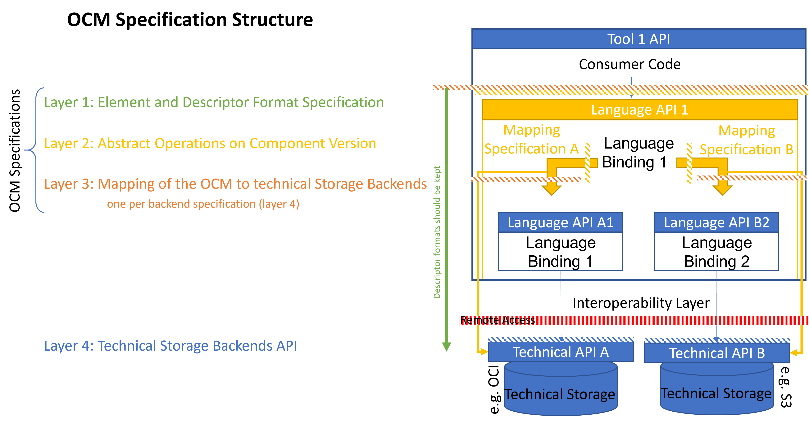
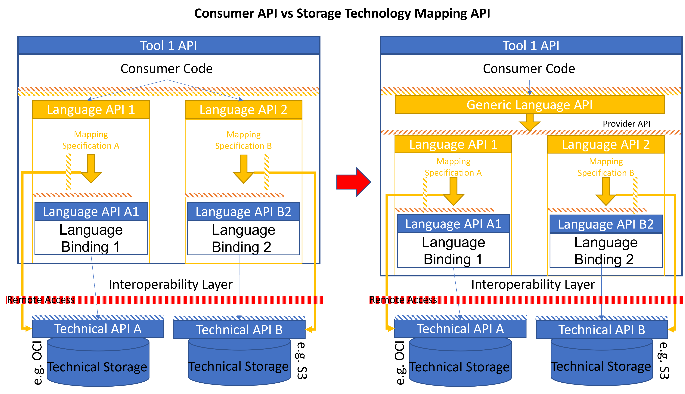

# Open Component Model Specification

This specification is divided into three parts:

- Layer 1: The [model elements](model.md) defined by the Open Component Model
- Layer 2: The [abstract operations](operations.md) , which must be provided to
  interact with those model elements stored in any OCM persistence
- Layer 3: The [interoperability specifications](interoperability.md) describing how the model elements
  are mapped to elements of an underlying persistence layer
  (for example and OCI registry)

 

Layer 1 describes the elements and data formats the Open Component Model deals
with. All client APIs MUST provide a binding
for the mandatory operations for the client code and SHOULD provide a
binding for the optional ones.

Layer 2 describes the abstract operations, which handle the persistence
of the described top-level elements. All client APIs MUST provide a binding
for those operations for the client code.

The OCM specification does not explicitly describe a dedicated remote API for
interacting with a repository conforming to the OCM specification.
Instead, it focuses on the mapping of the OCM functionality to an already
existing, common storage backend, like the OCI Registries.

Layer 3 defines how the elements of layer 1 are mapped to various
storage technologies. The border between a client tool and a storage backend,
and therefore the interoperability layer, is typically the API of
the storage backend.

This avoids the need for a dedicated OCM server infrastructure. Client code
includes a dedicated binding for the supported storage technology and
an implementation of the specified mapping of the OCM elements to the
storage elements. This will then be encapsulated behind a common binding
of an interpretation of the layer 1 and 2 specification for the dedicated client
environment.

An implementation of this layer for a dedicated storage technology MUST
implement this mapping by supporting the mandatory abstract model operations
defined in layer 2. It SHOULD implement the optional operations, also.

 

There are two basic ways how layer 1/2 and layer 3 can interact in a given
language binding.

1) The left diagram in the above picture shows two independent implementations
   for two storage technologies. Here, the consumer code has to deal
   with different variants of an OCM conform API to deal with different storage
   technologies. This is a valid implementation, but it makes it extremely
   difficult for tools on top of these APIs to work with different technologies.
   All tools have to implement this technology fork on their own.
2) The right diagram shows the preferred solution. A *generic language binding*
   for layer 1 and 2 of the specification maps the operations to an internal
   *Provider API* that has to be implemented by a dedicated mapping
   implementation. According to information provided by a repository specification,
   which is already part of the OCM specification, the fork can be implemented
   transparently for the consumer code.

This way, all appropriate clients can interoperate with all instances of the
supported storage backend types.

The binding provided by this project offers a general client API conforming
to layer 1 and 2 (package [github.com/open-component-model/pkg/contexts/ocm](../../pkg/contexts/ocm))
and a provider API for embedding different storage backend mappings
(package [github.com/open-component-model/pkg/contexts/ocm/cpi](../../pkg/contexts/ocm/cpi)),
which will then be available for the generalized client API.
Mappings are provided for the filesystem persistence and for OCI registries.

Layer 4, as shown in the picture, is finally out-of-scope for this
specification. It describes the storage-technology-specific APIs, which 
will be used as basis for the OCM mapping specification dedicated to
this storage technology.