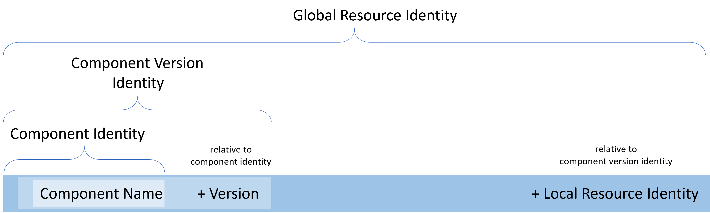
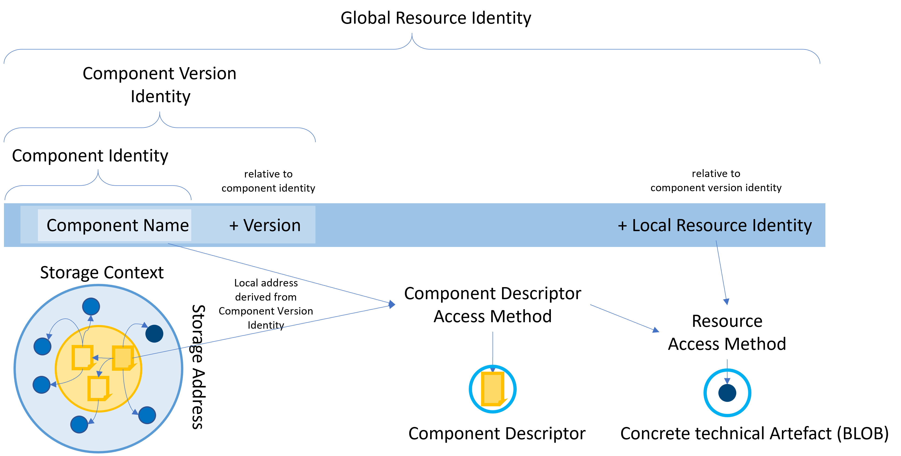

# Elements used by the Open Component Model

The Open Component Model provides a formal description of 
delivery artefacts for dedicated semantics that are accessible
in some kind of repository.

This leads to the following major elements that must be specified
as part of the Open Component Model specification

- [Repositories](#repositories)
- [Components](#components)
  - [Component Versions](#component-versions)
    - [Artefacts](#artefacts)
      - [Sources](#sources)
      - [Resources](#resources)
      - [Artefact Access](#artefact-access)
    - [Labels](#labels)
- [Repository Contexts](#repository-contexts)
- [Signatures](#signatures)

Those elements partly use further sub-level elements that are
defined in the context of their usage.

## Repositories

A *Component Repository* is a dedicated entity that provides technical access
to the other elements of the Open Component Model.

So far, we don't define a repository API for a dedicated technical native
instance of an OCM repository, because we want to use existing storage
subsystems, without the need of running OCM specific servers (Nevertheless,
such an API is still compatible with this specification and could be defined in
the future).

Therefore, a component repository is typically given by a well-known storage
subsystem hosting a content structure adhering to an [element mapping specification](interoperability.md) 
for this kind of storage backend (e.g. OCI).

So, any tool or language binding can map an existing storage technology into an
OCM repository view by implementing the [abstract operations](operations.md)
using this specification for the dedicated storage technology.

If required, an own specification for a native OCM repository (similar to the
[OCI distribution spec](https://github.com/opencontainers/distribution-spec/blob/main/spec.md))
can be added.

## Components

A *Component* is an abstract entity describing a dedicated usage context or
meaning for provided software. This semantic is defined by the owner of a
component and subsumed by the component identity. It is technically defined
by a globally unique identifier.

A component identifier uses the following naming scheme:

<div align="center">

*&lt;DNS domain>* `/` *&lt;name component> {* `/` *&lt;name component> }*

</div>

Hereby the DNS domain plus optionally any number  of leading name components MUST 
be owned by the provider of a component. For example, `github.com`, as DNS domain
is shared by lots of organizations. Therefore, all component identities provided
based on this DNS name, must include the owner prefix of the providing
organization, e.g. `github.com/gardener`.

The component acts as a namespace to host multiple [*Component Versions*](#component-versions),
which finally describe dedicated technical artefact sets, which describe the
software artefacts required to run this tool.

*Example:*

The component with the identity `github.com/gardener/external-dns-management` 
contains software versions of a tool maintaining DNS entries in DNS providers 
based on Kubernetes resource manifests.

Hereby, the prefix `github.com/gardener` describes a *GitHub* organization owned
by the Gardener team developing the component `external-dns-management`.

### Component Versions

A *Component Version* is a concrete instance of a [Component](#components).
As such it describes a concrete set of [Artefacts](#Artefacts)
adhering to the semantic assigned to the containing [Component](#components) (by its owner).
It has a unique identity composed of the [component identity](#components) and
a version name following the [semantic versioning](https://semver.org) 
specification.

So, all versions provided for a component should provide software artefacts
with the semantic defined by the component. For example, for a component
pretending to be a Kubernetes DNS Controller, all provided versions should
provide versions of a DNS Controller, and not an ingress controller.

A component version is formally described by a [Component Descriptor](#component-descriptor).

#### Component Descriptor

A *Component Descriptor* is used to describe a dedicated component version.
It is a YAML file with the structure defined [here](../formats/compdesc/README.md)

The main purpose of a component version is to describe a set of delivery
[artefacts](#artefacts). Such an artefact set is composed with two
mechanisms:
 1) Artefacts can be directly described by a component descriptor
 2) Artefacts described by another component version can be included into
    the local artefact set by describing a [reference](#references) to this
    component version.

Those artefact composing elements all feature a common [set of attributes](#composing-the-artefact-set),
which are used to uniquely identify the elements in the context of their component
descriptor. Additionally, they provide a possibility to formally enrich the
information attached to an element by using an arbitrary number of 
appropriately named labels without the need for explicit dedicated model
attributes (for example, attaching hints for the triage of identified
vulnerabilities for this artefact).

A component descriptor describes:
- a history of [Repository Contexts](#repository-contexts) describing
  former repository locations of the component version along a transportation
  chain
- a set of [Labels](#labels) to assign arbitrary kinds of information to the
  component version, which is not formally defined by the Open Component Model
- an optional set of [Sources](#sources), that were used to generate the 
  [Resources](#resources) provided by the component version
- a set of [Resources](#resources) provided with this component version
- an optional set of [References](#references) included component versions
- an optional set of [Signatures](#signatures) provided by some authority 
  to confirm some state or origin of the component version

##### Composing the Artefact Set

There are several elements in a [component descriptor](#component-descriptor),
which can be used to compose the artefact set finally described by a component
version.

- elements, which directly describe an [artefact](#artefacts) as part of the 
  component descriptor.
- [references](#references), which can be used to include artefact sets described
  by other components.

All those descriptive elements share a common basic attribute set.
First, such an element must be uniquely identifiable in the context
of a component version. Therefore, it requires an [*Identity*](#identity).
To be able to attach additional formal meta to such an element, which
is not directly described by existing model elements, it is possible to
define arbitrary [*Labels*](#labels). This enables the use of application specific
attributes, without the need of extending the basic component model for every
new arising use case.

###### Identity

[Resources](#resources), [Sources](#sources), and [References](#references)
have a unique identity in the context of a [Component Version](#component-versions).

All those element types share the same notion of an identity, which is a set
of key/value string pairs.
This includes at least the value of the `name` attribute of those elements.
If the element name cannot be chosen uniquely an optional `version` attribute
can be provided to assure uniqueness in the context of the [component version](#component-versions).
In such a case this attribute will be added to the effective identity
attribute set.
If even this is not sufficient to meet the requirements to identify 
artefacts in the context of the component version, explicit identity attributes
can be defined. If given, all those
attributes always contribute to the identity of the element.

The element identity is composed by the following formal fields:

- **`name`** (required) *string*

  The name of the element. In most of the cases the name should be chosen
  to be unique in the context of the list of elements. 
  It basically also expresses the meaning or purpose of the element in the
  context of the component version. But it might be the
  case that multiple elements should be used for the same purpose. For example,
  a component version is used to describe multiple versions of an artefact,
  which should be selected for different environment versions for deployment.
  Then, they could share the same name, to be able to easily find all those
  elements. In such a case the name is not sufficient to uniquely identify
  a dedicated element.

- **`version`** (optional) *string*

  This optional attribute version describes the version of the element.
  If given, and the name of the element is not unique in its context, the
  version is added to the identity attribute set.

- **`extraIdentity`** (optional) *map[string]string*

  If name and version are not sufficient to provide a unique selection 
  scheme, any arbitrary identity dimension can be added by using this field.
  If given, all those attributes contribute to the identity of the element
  and must be given to uniquely identify an element.

Using attributes of an artefact for its identity makes it easier to formally
describe the identity and to select a dedicated artefact from the set of
described artefacts. It avoids the need to
marshal a dedicated identity scheme for an intended usage scenario into a
single attribute value. Instead, different attributes can be used to represent
the dedicated selection dimensions. Selecting all artefacts for partial set
of constraints is then just a partial match of the set of identity attributes.

For example:

You want to describe different image versions to be used
for different Kubernetes versions and for multiple purposes. With the identity
attributes this can easily be modeled by using
- the `name` attribute for the purpose (e.g. DNS controller)
- the `version` attribute for the image version
- and an extra identity attribute for the intended Kubernetes Version.

Then you don't need to derive artificially unique artefact names, instead
the identity of the artefact can naturally be composed by using appropriate
attributes. Selecting all artefacts for a dedicated purpose is possible
by selecting all artefacts with the appropriate `name` attribute, without the
need of parsing an artificial structure imprinted on the name attribute.

<div align="center"> 

</div>

Every resource described by the Open Component Model can therefore be identified
by the triple *(Component Identity, Version Name, Local Resource Identity)*.


###### Labels

*Labels* can be used to add additional formal information to a component
model element, which do not have static formal fields in the
[component descriptor](#component-descriptor). Its usage is
left to users of the component model, or better to the used toolsets
looking at component versions (for example: a scanning environment,
used to scan artefacts for vulnerabilities, uses a dedicated label 
to control its behavior).

To be able to evaluate labels used by dedicated tool environments for any
[component version](#component-versions), the same
label name must have the same meaning, regardless by which component provider
they are generated. To assure that this information
has a globally unique interpretation or meaning, labels must comply with some
naming scheme and use a common [structure](../names/labels.md).

Labels are described by the element field 

- **`labels`** *[]label*

  A list of arbitrary labels described by a formal name with a globally
  unique meaning (see [label structure](../names/labels.md)

#### Artefacts

An *Artefact* is a blob containing some data in some technical format.
Every artefact described by the component version has
- an [Identity](#identity) in the context of the component version
- a dedicated globally unique [type](../names/resourcetypes.md) representing
  the kind of content and how it can be used
- a set of [Labels](#labels) to assign arbitrary kinds of information to the
  component version, which is not formally defined by the Open Component Model.
- a formal description of the [Access Specification](#artefact-access) ,
  which can be used to technically access the content of the artefact in form of
  a blob with a format defined by the artefact type. If there are multiple variants
  possible for the blob format, the access specification must be able to
  describe an optional media type. Applying an access specification always
  yields a media type. It might be implicitly provided the [implementation of
  an access method](operations.md#access-methods) or explicitly provided by the
  access specification.
- a (optional) digest of the artefact that is immutable during transport steps.

Those attributes are described by formal fields of the element description
in the component descriptor:

- the [identity](#identity) fields are directly embedded

- **`type`** (required) *string*

  The [type of an artefact](../names/resourcetypes.md) uniquely specifies the
  technical interpretation of an artefact, its kind, independent of its 
  concrete technical representation.

  If there are different possible technical representation the [access method](#artefact-access)
  returns the concrete format used for the returned blob.

  For example, a helm chart (type `helmChart`) can be represented as
  OCI artefact or helm chart archive. Nevertheless, the technical meaning is
  to be a helm chart, even if represented as OCI image. The type `ociImage`
  describes an object that can be used as container image. So, although the
  technical representation might in both cases be an OCI image manifest, its
  semantics and use case is completely different. This is expressed
  by the chosen type of the artefact, which focuses on the semantics.

- **`labels`** (optional) *[]label*

  A list of arbitrary labels described by a formal name with a globally
  unique meaning (see [label structure](../names/labels.md)

- **`access`** (required) *access specification*

  The [access specification](../names/accessmethods.md) for the actual artefact.
  The specification is typed. The type determines an access method to use
  to access the artefact blob. This type determines the technical procedure
  to use to access the artefact blob as well as the specification of the
  attributes that are required by this procedure to be able to identify a
  dedicated target blob.

The Open Component Model distinguishes two kinds of artefacts:
- [*Sources*](#sources) are optional artefacts that contain the sources, which
  were used to generate the deployment-relevant *Resources*
- [*Resources*](#resources) are artefacts that finally make up the deployment
  relevant set of artefacts

##### Sources

A *Source* is an [Artefact](#artefacts), which describes the sources that were
used to generate one or more of the [Resources](#resources) described by the
[component descriptor](#component-descriptor). This information might be used
by scanner tools to extract more information about then final binaries.

Source elements do not have specific additional formal attributes.

##### Resources

A *Resource* is a delivery [Artefact](#artefacts),
intended for deployment into a runtime environment, or describing additional
content, relevant for a deployment mechanism. For example, installation procedures
or meta-model descriptions controlling orchestration and/or deployment mechanisms.
(A simple example how such elements could be used to construct a deployment
mechanism on top of the Open Component Model can be found [here](../reference/ocm_toi.md).)

The Open Component Model makes absolutely no assumptions, about how content described
by the model is finally deployed or used. All this is left to external tools and tool
specific deployment information is formally represented as other artefacts with
an appropriate dedicated own type.

In addition to the common [artefact](#artefacts) information, a resource
may optionally describe a reference to the [source](#sources) by specifying
its artefact identity.

A resource uses the following additional formal fields:

- **`digest`** (optional) [*digest*](#digest-info)

  If the component descriptor is signed (directly or indirectly by one of its
  referencing component versions), a digest of a resource is stored along with
  the resource description. This is required because there might be different
  digest and resource normalization algorithms.

- **`srcRef`** (optional) *struct*

  This field is used to describe the sources used to generate the resource.
  The selection is done by the following two fields:

  - **`identitySelector`** *map[string]string*

    [Identity attributes](#identity) determining an appropriate [source](#sources)
    element.

  - **`labels`** (optional) *[]label

    A list of arbitrary labels described by a formal name with a globally
    unique meaning (see [label structure](../names/labels.md)) can be used
    to attach more information about the part or kind of usage of the sources.


##### Artefact Access

The technical access to the physical content of an
[artefact](#artefacts) described as
part of a [Component Version](#component-versions) is expressed by an
*Access Specification*. It describes the [type](../names/accessmethods.md) of
the *access method* and the type-specific access path to the content in the
[repository context](#repository-contexts) the component descriptor has been
retrieved from.

Every access specification has a formal type and type specific attributes.
The type uniquely specifies the technical procedure how to use the
attributes and the [repository context](#repository-contexts) of
the component descriptor containing the [access method specification](../formats/accessmethods/README.md)
to retrieve the content of the artefact.

There are basically two ways an artefact blob can be stored:
- `external` access methods allow referring to artefacts in any other
  technical repository as long as the access type is supported by the
  used tool set.
- `internal` access methods ([`localBlob`](../../pkg/contexts/ocm/accessmethods/localblob/README.md)).
  are used to store an artefact together with the component descriptor in an
  OCM repository. These methods must be supported by all OCM repository
  implementations.

The specification must contain at least the field

- **`type`** (required) *string*

  The type of the access method. It determines the possible and required 
  additional fields of the access specification.


The content of a described artefact is accessible by applying its
global identity triple to the following procedure:

- [lookup](operations.md#mandatory-model-operations) of a [component version](#component-versions)) and its 
  [component descriptor](#component-descriptor) by using its
  component identity and version name in
  the desired [repository context](#repository-contexts)
- identify the artefact by its local [identity](#identity) (distinguish between [source](#sources)
  and [resource](#resources))
- [apply](operations.md#access-methods) the described [access method](#artefact-access)

<div align="center"> 

</div>

#### References

A component version may refer to other [component versions](#component-versions)
by adding a *Reference* to the component version. 

The reference describes only the component version and no location or OCM
repository. It is always evaluated in the actual repository context.
This means, that the artefact set described by the referenced component version
is added to the local artefact set described by the component version defining
the reference. To keep a unique addressing scheme, like [artefacts](#artefacts),
references have an [identity](#identity). 

A reference element has the following additional formal fields:

- **`componentName`** (required) *string*

  The identity of the component whose version is referenced.
  The elements common version field is required in this usage context.

##### Resource Reference

Following the chain of [references](#references), starting from an initial
[component version](#component-versions),
any local or non-local artefact can be addressed relative to a component
version by a possibly empty sequence (for a local artefact) of reference
identities followed by the artefact identity in the context of the finally
reached component version.

The composite is called *Source Reference* or *Resource Reference*.
It can be used in artefacts to refer to other artefacts described by the 
same component version containing the artefact.

*Example:*

CompVers: `A:1.0.0`
```
- Resources: 
  - name: DEPLOYER
    type: mySpecialDeploymentDescription
 
- References:
  - name: content
    component: B:1.0.0
```

CompVers: `B:1.0.0`
```
- Resources:
  - name IMAGE
    type: ociImage
```

The deployment description contained in CompVers `A:1.0.0` may have
the following content

```
...
deploymentImages:
  - resource:
      name: IMAGE
      referencePath:
      - name: content
```

This description contains a resource reference indicating to
use the resource `IMAGE` in component version `B:1.0.0` when evaluated
in the context of component version `A:1.0.0`.

The reference path may contain any number (including zero) entries, describing 
the path from the root component version along the nested `references` entries
of involved component versions to the component version finally describing the
desired resource. Hereby, the `name` is the name of the reference entry in the
component descriptor, it is NOT the component name. If no or an empty path is given,
the resource is looked up in the actual component version.

Besides the name, there might also be extra identities to uniquely identify the next
element.

This way any content-related tool can interact with the Open Component Model,
by identifying resources and finally access resources described by the component
model.

This kind of relative access description is location-agnostic, meaning, independent
of the [repository context](#repository-contexts) used to access
the initial component version and resource. The stored description only
includes identities provided by the model. They can then be evaluated in a
dedicated repository context to finally obtain the artefact content
(or location) in the actually used environment (for example, after
transportation into a fenced environment).

Depending on the transport history of the component version, the
correct artefact location valid for the actual environment is used.

#### Signatures

A [component version](#component-versions) may be signed by some authority.
It is possible to have multiple signatures in the component descriptor.

When signing a component version, all included component versions are
digested by digesting their [resources](#resources) and normalizing
their component descriptors (see [Digest Info](#digest-info)).

Every signature entry has the following formal fields:

- **`name`** (required) *string*

  The name if the signature. It must be unique in the context of a component
  version.

- **`digest`** (required) [*digest*](#digest-info)

  The digest of the component version used to generate the signature.
  Different signatures may use different digest algorithms.

  The digest of a component version does not include volatile fields, like
  the access specification, which can change along a transportation chain.

- **`signature`** (required) [*signature*](#signature-info)

  The signature for the specified digest.


##### Digest Info

A digest is specified by the following fields:

- **`hashAlgorithm`** (required) *string*

  The used digest algorithm.

- **`normalisationAlgorithm`** (required) *string*

  The used normalization algorithm for the signed element.

  For example, the digest of a component version must not include volatile
  fields, like
  the access specification, which can change along a transportation chain.
  To achieve a stable byte stream for calculating the digest, the component
  descriptor is transformed into a normalized form. The method to do so 
  is specified by the normalization algorithm.

  Even artefact blobs can be normalized, for example the technical representation
  of an OCI image may depend on the access method. But the digest should be independent
  of the technical representation. The default is to just use the blob digest,
  but for OCI images the digest of the image manifest is used, regardless of the
  technical representation.

  This is handled by *Digest Handlers*, which can be defined for dedicated
  artefact type and media type combinations. All implementations must provide
  appropriate handlers for the used resources types to be interoperable.

- **`value`** (required) *string*

  The digest itself.

##### Signature Info

A signature is specified by the following fields:

- **`algorithm`** (required) *string*

  The used signing algorithm.

- **`mediaType`** (required) *string*

  The media type of the technical representation of the signature value.

- **`value`** (required) *string*

  The signature itself.

- **`issuer`** *string*

  The description of the issuer.


## Repository Contexts

A *Repository Context* describes the access to an [OCM Repository](#repositories).

This access is described by a [formal and typed specification](../names/repositorytypes.md)

A [component descriptor](#component-descriptor) may contain information
about the transport history by keeping a list of repository contexts.
It should at least describe the last repository context for a remotely accessible
OCM repository it was transported into.

## Signatures

A component version can be signed. The signatures are stored along with the
[component descriptor](#component-descriptor).
There may be multiple signatures. Every signature is defined by its name, a type,
a normalization algorithm, a digest and a digest algorithm used to calculate the digest
on the normalization.

Because a component descriptor contains information, which might change over time,
a [normalized version](normalization.md) of the component descriptor, containing
only signature relevant  information, is used to calculate the digest of a
component version.
