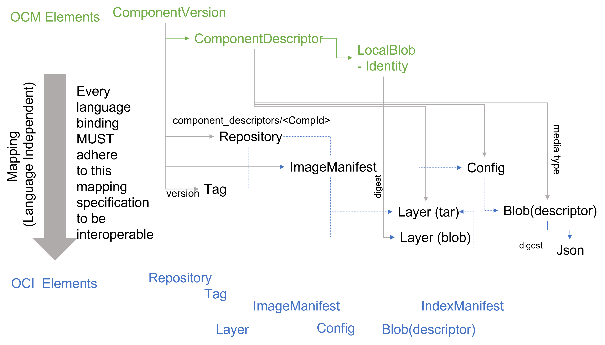

# OCM Mapping to an OCI Registry

OCM component versions can be stored in OCI registries which 
are conforming to the [OCI distribution specification](https://github.com/opencontainers/distribution-spec/blob/main/spec.md).
Additionally, a registry must support a deep repository structure.

An OCI registry can be used to host multiple OCM repositories.
Such an OCM repository is [identified by an OCI repository reference](../../../../pkg/contexts/oci/repositories/ocireg/README.md).

An OCM *component identifier* is mapped to a sub *repository name* prefixed
with `component-descriptors/`. The complete repository name is

*&lt;oci base repository>* `/component-descriptors/` *&lt;component id>*

An OCM *version name* of a component version is mapped to an OCI *tag*.

The *component version* is represented as OCI *image manifest*.

This manifest uses a config media type `application/vnd.ocm.software.component.config.v1+json`.
According to the [OCI image specification](https://github.com/opencontainers/image-spec/blob/main/spec.md) this must be a JSON blob.
This json file has one defined formal field:

- **`componentDescriptorLayer`** (required) [*OCI Content Descriptor*](https://github.com/opencontainers/image-spec/blob/main/descriptor.md)

  It references the layer blob containing the component descriptor. The layer
  always must be layer 0 of the manifest. It uses the media type
  `application/vnd.ocm.software.component-descriptor.v2+yaml+tar`

TODO: decide which media type to use for v3 descriptors.

The descriptor layer contains a tar archive with at least a single file
with the name `component-descriptor.yaml` containing the component descriptor of the
component version. This file should always be the first file in the tar archive.

OCM *Local Blobs* are stored in additional OCI *Image Layers*. The local blob
identifier stored in the `localBlob` access specification is the OCI *blob digest*
of the blob. The media type of the blob is the one specified in the
access specification.

## Version Mapping

The Open Component Model supports version names according to [semantic versioning](https://semver.org/)[^1]. The tags used to represent versions in the OCI specification do not allow to directly use semantic version names as tags, because the plus (`+`) character is not supported. Therefore, the open component model version names have to be mapped
to OCI-compliant tag names.

[^1]: In addition to the specification of semantic versioning OCM version names may use a leading `v`.

The following mapping for version is used, here:
- the optional plus `+` character used to attach build information in semantic versions is mapped to the sequence (`.build-`)

Mapping tags back to versions uses the following mappings:
- the last character sequence (`.build-`) is mapped to a plus (`+`) character.

## Blob Mappings

Local blobs with an OCI artifact media type will implicitly be mapped to a regular
artifact. The *reference hint* provided by the specification of the local access
is used to compose a repository name of the form:

*&lt;oci base repository>* `/` *&lt;reference hint>*

Without a given tag, the provided external access specification (of type `ociArtifact`)
uses a digest based reference.

Additional blob transformations can be added by registering appropriate blob handlers.

## Binding

The constants of the mapping are defined [here](../../../../pkg/contexts/ocm/repositories/genericocireg/componentmapping/constants.go).

The reference implementation of the mapping is contained in package [github.com/open-component-model/ocm/pkg/contexts/ocm/repositories/genericocireg](../../../../pkg/contexts/ocm/repositories/genericocireg).

The blob handler for the described blob mappings can be found [here](../../../../pkg/contexts/ocm/blobhandler/oci/ocirepo).