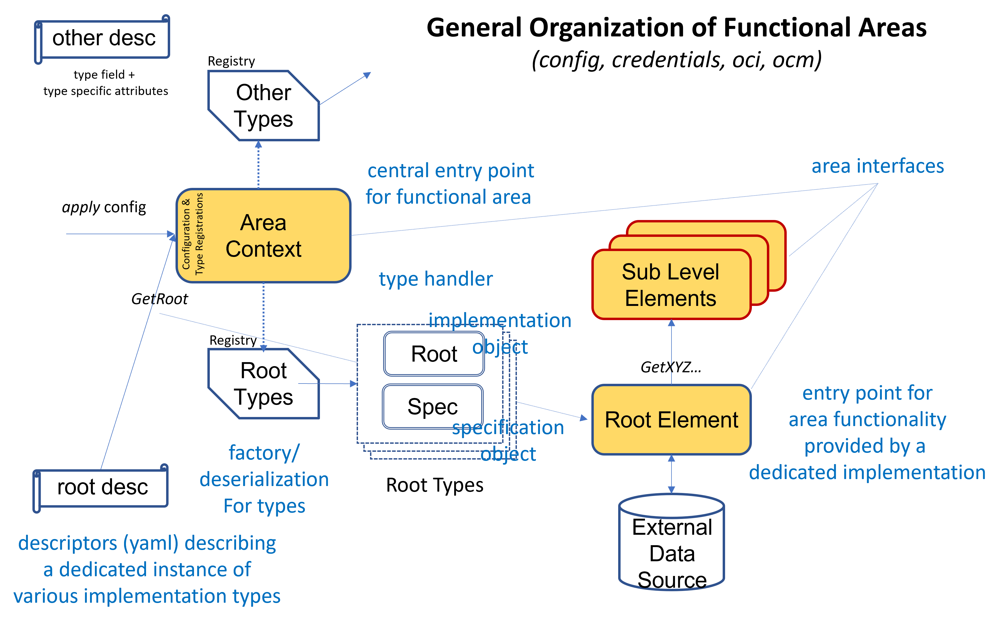

# Contexts

A context object is the entry point for using dedicated functional areas.
It bundles all settings and extensions point implementations for this area.

Therefore, it provides a root object of the type `Context`. This context
object then provides methods to
- set configurations and to
- get access to elements belonging to this area.

There might be any number of such context objects at the same time and with
different settings. Context objects are typically intended to have a short
lifetime (for example to execute a dedicated request) and can be
garbage collected afterwards.

## Working with contexts

A context provides access to a set of basic root elements of the functional
area it is responsible for. The root elements can then be used to access
nested or dependent objects.

The basic elements of most context types are *Specifications* and
*Repositories*.  A specification object provides serializable attributes
used to describe dedicated elements in the functional area. They are typed.
There might be different types (with different attribute sets) used to
describe instances provided by different implementations. Those descriptions
are called descriptors.

The root element below the context object is typically a *Repository*
object, which provides access to elements hosted by this repository.

The context itself manages all the specification and element types and
acts as a central entry point to deserialize JSON/YAML based specification
descriptors and to gain access to the described effective root elements.
Those context extension points are managed by *Registries* used to 
configure implementations and specification types by globally
unique names. These registration features are provided for every extension
type and are accessible at the context object.

For example, the OCI context manages repository specifications and types
used to describe instances of various types of repositories hosting OCI
Artifacts (one such specification/repository type is an *OCI Registry*,
another one the docker daemon and a third one a filesystem representation
for storing OCI artifacts). All those different implementations can
be used by a uniform common interface.

The repository object provided for a repository specification then provides
access to namespaces (in OCI speak *OCI repositories*), which again provide
access to OCI artifacts (versions): manifests and indices.

More complex contexts (especially the OCM context) may offer access to a more
complex object ecosystem, including more kinds of specification and object
types.

Typically, a context is based on contexts of required functional areas,
for example an OCI context uses a credential context to gain access to
required credentials, which again uses a configuration context to
configure itself from a central configuration provided by a shared configuration context.

## Functional areas provided by the OCM library

The following context types are provided:

- `config`: configuration management of all parts of the OCM library.
   It provides a uniform but generic way to manage configuration and its
   serialized form for all kinds of configuration cosumers by supporting
   typed descriptors which, are mapped to objects capable to configure
   dedicated configuration targets.
- `credentials`: credential management. It acts as factory to provide
   credentials for consumption targets in various environments (for example,
   GitHub, OCI registries, S3 repositories, etc). Those targets are described
   by so-called *comsumer ids*, which are mapped to credentials by the credentials context.

   It includes a *config* context.
- `oci`: working with OCI registries.
   It acts as central access point to instantiate OCI registry view for
   different backends hosting OCI images and OCU artifacts, like an
    OCI registry, a filesystem representation or a docker daemon.

   It includes a *credentials* context.

- **`ocm`**: working withOCM repositories.
   This is the central context type providing access to the elements
   of the open component model.

   It includes an *oci* context.
- `clictx`: command line interface.
   It acts as configuration container for the OCM command line client,
   hosting an OCM context.
- `datacontext`: base context functionality used for all kinds of contexts.

To just use the library without special configuration the complete standard
settings will be available by accessing the default context for the area of
question. Alternatively, context instances with specialized configurations 
can be orchestrated by context builders.

## Package organization

All functional areas supported by contexts can be found as sub packages of
`github.com/open-component-model/ocm/pkg/contexts`.

A context package directly contains the typical user API for the functional
area. The most important interface is the interface `Context`. It acts as main
entry point to access the functionality of the functional area.

Elements required to provide own extension point implementations
(for example new specification and repository types) can be found in the
`cpi`(Context Programming Interface) sub-package. Internal implementation
utilities are located in the `internal` sub package. It is not intended to
be used outside the context package.

The sub package `repositories` contains sub packages for different implementations of the basic root elements of the context.

The sub package `config` provides implementations for configuration objects
usable to configure contexts with a shared configuration context.

The sub package `attrs` provides implementations for attribute objects
supported by this context type. Attributes a singleton settings which
might be attached to any kind of contexts. They are inherited along a
context  usage relation (for example ocm -> oci -> credentials -> config).

If a context type supports multiple extension types there is typically
a dedicated sub package for this type (for example `github.com/open-component-model/pkg/contexts/ocm/accessmethods`), which again
contains the various implementation types in sub packages.

### The OCM context organization

The following diagram shows the element structured used for the OCM context as
an instance of the general context blueprint described above.

Besides the standard sub packages, there are extension packages for

- `blobhandler`: Handlers responsible to upload local blobs. By default,
  local blobs are kept as local blobs when addedd to an OCM repository.
  *Upload handlers* can be used to influence this behaviour and export
  the content of dedicated blobs again into local repositories according
  to their native technologies, for example OCI images, S3 blobs, etc.

- `download`: Handlers understanding dedicated artifact and mime types
  capable to provide then as filesystem content consumable by their
  native tool set, for example Helm charts.

- `labels`: The handling of predefined label content.
- `valuemergehandler`: Merge algorithms used to support the merge
  of volatile labels during a transport step (used by the transport tool)

The package `plugin` contains the plugin interface of the library,
which can be used to provide various kinds of extension points in form of
separate executables.
The embedding of handlers provided by plugins can always be found
in the package `plugin` below the dedicated extension point handler 
package.

Additionally, there are more functional
packages hosting predefined applications based on the open component model:

- `transfer`: A generic transport tool, which can be used to transport
  component versions from one repository environment to another one.
  It is completely configurable by *transport handler* and *blob upload handlers* (configured as extensions in the used OCM context). A transport
  handler may control the recursion behaviour for following component
  references and the way described artifacts are transported into the target
  environment.
- `signing`: a standard tool used to sign and verify component versions using different
  signing, hashing and normalization procedures.

- `routingslip`: A standard application using OCM labels to implement
  routing slips.

## Getting access to a context object

There is always a `DefaultContext()` in the context package of a
functional area which gives access to a default context
object configured with all the extension implementations provided by the
actual version of the library.

Using a builder (functions starting with `With...`), it is possible to
orchestrate own context objects from scratch.

The function `New()` creates a new context object inheriting the
configuration of the default context. It accepts an optional mode
argument used to control the behaviour of the context creation and 
the handling of other used context types:

- `MODE_SHARED` uses the default contexts for unset nested context types.
- `MODE_DEFAULTED` uses dedicated context instances configured with the
  context type specific default registrations.
- `MODE_EXTENDED` uses dedicated context instances configured with
  context type registrations extending the default registrations.
- `MODE_CONFIGURED` uses dedicated context instances configured with the
  context type registrations configured with the actual state of the
  default registrations.
- `MODE_INITIAL` uses completely new contexts for unset nested context types
  and initial registrations.
- 
Initial contexts do not contain any registrations for extension point
implementations. They can/must be configured according to dedicated
needs of their creator.

## Working with Specifications

Specifications are a central concept of the complete library. They are
used to describe dedicated instances of elements managed by contexts,
for example, access methods in the OCM context, or repository objects.

They always feature a versioned globally unique type and a
serialization/deserialization mechanism. There might be
different specification realms per context, for example specifications
for access methods and repositories in the OCM context.

The context object manages dedicated schema registrations per realm.
Therefore, the `github.com/open-component-model/pkg/runtime` package is
used. It provides support for such schemes and the handling of
specification types for those schemes. A specification type is
split into a kind and a version. The kind describes the semantics (and
the internal object representation) of a dedicated kind of specification,
while the version may describe different serialization formats.
(If no version is specified the version `v1` is assumed)

The scheme object manages the deserialization of a JSON/YAML based external
representation of a specification into its internal object format.

A context object provides methods to register new specification types
for the supported realms. The implementations/variants supported by this
library will automatically be registered into default schemes used by
the default contexts of all supported functional areas.

A specification object can then be used by the context to provide 
access to the described object, for example, a specification for
an OCM repository can be used to gain access to the implementation object
representing this repository instance. Those objects then provide methods
to gain access to the repository content.

